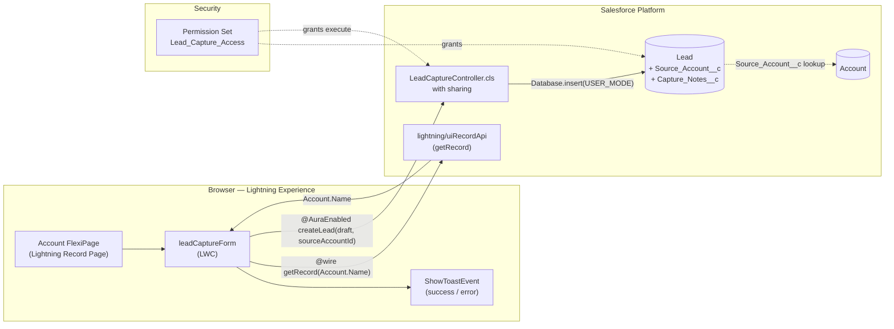
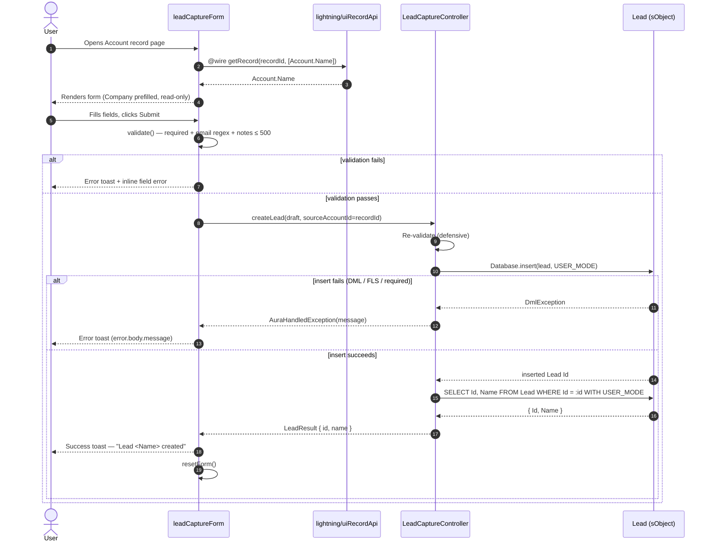
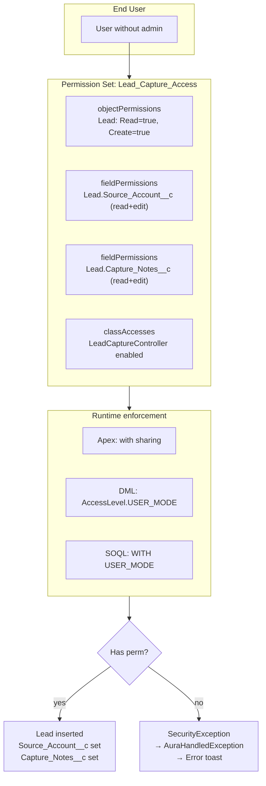

# Lead Capture Form — Solution Overview

A Lightning Web Component placed on the Account record page that creates a Lead linked back to the parent Account, with toast-based feedback and access gated by a Permission Set.

---

## 1. Component Architecture

### Pieces

| Layer | Component | Responsibility |
|---|---|---|
| UI | `leadCaptureForm` (LWC) | Renders the form on the Account FlexiPage; reads Account.Name via `@wire(getRecord)`; client-side validation; calls Apex; toast feedback; resets form on success. |
| Server | `LeadCaptureController` (Apex, `with sharing`) | Validates payload server-side; inserts Lead with `Database.insert(..., AccessLevel.USER_MODE)`; stamps `Source_Account__c` with the page's Account Id; returns `{ id, name }`. |
| Data | `Lead.Source_Account__c` | Lookup(Account), `SetNull` on parent delete. Relationship label: *Captured Leads*. |
| Data | `Lead.Capture_Notes__c` | Long Text Area (500 chars). |
| Security | `Lead_Capture_Access` Permission Set | Lead Read+Create, FLS on both custom fields, Apex class access. |

### Why these choices

- **Apex controller over `lightning/uiRecordApi.createRecord`** — the requirement explicitly names an Apex controller in the Permission Set. Centralizing validation, FLS-enforced DML, and source-account stamping in Apex keeps the LWC dumb and gives one place to add server-side rules.
- **`@wire(getRecord)` for Company** — avoids an extra Apex round-trip just to read `Account.Name`; LDS caches it and respects FLS automatically.
- **`with sharing` + `AccessLevel.USER_MODE`** — the Permission Set becomes the single source of truth for CRUD/FLS; any user lacking the perm set hits an access exception at insert time.
- **No trigger** — single-record creation from a UI, validation is in LWC + Apex. A trigger would be over-engineering.
- **Standard `LeadSource` picklist values reused** — `Web`, `Phone Inquiry`, `Partner Referral`, `Other` are all standard out-of-the-box values; no picklist metadata change needed. The LWC restricts the options shown.

---

## 2. Data Flow

### Validation matrix

| Field | Client (LWC) | Server (Apex) |
|---|---|---|
| First Name | optional | accepted as-is |
| Last Name | required, non-blank | required, non-blank |
| Email | required, regex `^[A-Za-z0-9._%+-]+@[A-Za-z0-9.-]+\.[A-Za-z]{2,}$` | same regex |
| Phone | optional | accepted as-is |
| Company | read-only, prefilled from Account.Name | required, non-blank |
| Lead Source | required, one of {Web, Phone Inquiry, Partner Referral, Other} | same enum check |
| Notes | maxlength=500 (input attribute) | length ≤ 500 |

Both layers validate. The client layer is a UX optimization (fail fast, no round-trip); the server layer is the security boundary (a determined caller can hit Apex directly).

---

## 3. Security Model

### Layer-by-layer

1. **Profile (org-wide baseline)** — no changes. Standard profiles do **not** grant Lead Create by default in this design; the Permission Set is the additive grant.
2. **Permission Set `Lead_Capture_Access`** — the single grant:
   - `objectPermissions`: Lead `allowRead=true`, `allowCreate=true`. Other CRUD bits intentionally `false` (no Edit/Delete/View All/Modify All from this perm set).
   - `fieldPermissions`: `Lead.Source_Account__c` (R/W) and `Lead.Capture_Notes__c` (R/W).
   - `classAccesses`: `LeadCaptureController` enabled (without this, the user gets a `System.NoAccessException` at the `@AuraEnabled` call boundary).
3. **Apex enforcement** — the controller is declared `with sharing` and **all** DML/SOQL uses `USER_MODE`. This means:
   - Sharing rules apply (lead visibility honored).
   - FLS is checked on every field the platform writes; if a user lacks FLS on `Source_Account__c` the insert errors rather than silently dropping the field.
   - CRUD is checked at insert; lacking Lead Create surfaces an exception.
4. **No "with sharing" bypass** — there is no `without sharing`, no `system.runAs`-style elevation. The whole code path runs as the calling user.
5. **Error sanitization** — exceptions are wrapped in `AuraHandledException` with the platform message preserved, so users see actionable validation errors but stack traces stay server-side.

---

## 4. File Inventory

| Path | Purpose |
|---|---|
| `force-app/main/default/lwc/leadCaptureForm/leadCaptureForm.js` | Component logic, wire, validation, submit |
| `force-app/main/default/lwc/leadCaptureForm/leadCaptureForm.html` | Template (form layout, fields, buttons) |
| `force-app/main/default/lwc/leadCaptureForm/leadCaptureForm.css` | 2-column grid layout |
| `force-app/main/default/lwc/leadCaptureForm/leadCaptureForm.js-meta.xml` | Exposed on `lightning__RecordPage` for Account |
| `force-app/main/default/classes/LeadCaptureController.cls` | `@AuraEnabled createLead(draft, sourceAccountId)` |
| `force-app/main/default/classes/LeadCaptureControllerTest.cls` | 10 test methods, 92% controller coverage |
| `force-app/main/default/objects/Lead/fields/Source_Account__c.field-meta.xml` | Lookup(Account), SetNull |
| `force-app/main/default/objects/Lead/fields/Capture_Notes__c.field-meta.xml` | LongTextArea(500) |
| `force-app/main/default/permissionsets/Lead_Capture_Access.permissionset-meta.xml` | Lead R/C + FLS + class access |
| `sfdx-project.json` | Project descriptor (sourceApiVersion 61.0) |

---

## 5. Verification Summary

Verified end-to-end on org `my-trailhead` (Trailhead playground) against Account `001g700000KuP1vAAF` ("Burlington Textiles Corp of America"):

- ✅ Component renders on the Account FlexiPage with Company prefilled & read-only.
- ✅ Happy path: submit → success toast "Lead created successfully! Lead Verify-McTestface created!" → form clears.
- ✅ SOQL confirms Lead with `Source_Account__c = 001g700000KuP1vAAF` and `Capture_Notes__c` populated.
- ✅ Missing Last Name → error toast + inline "Last Name is required."
- ✅ Invalid email → error toast + inline "Please enter a valid email address."
- ✅ Apex tests: 10/10 pass, 92% controller coverage.
- ✅ Console: 0 errors, 1 cosmetic warning (`connectedCallback` null return — no functional impact).

---

## 6. Post-Deploy Steps

1. Deploy metadata (already done on `my-trailhead`).
2. Assign **Lead_Capture_Access** Permission Set to end users.
3. Open App Builder → an Account Lightning Record Page → drag **leadCaptureForm** onto the page → Save → Activate.
